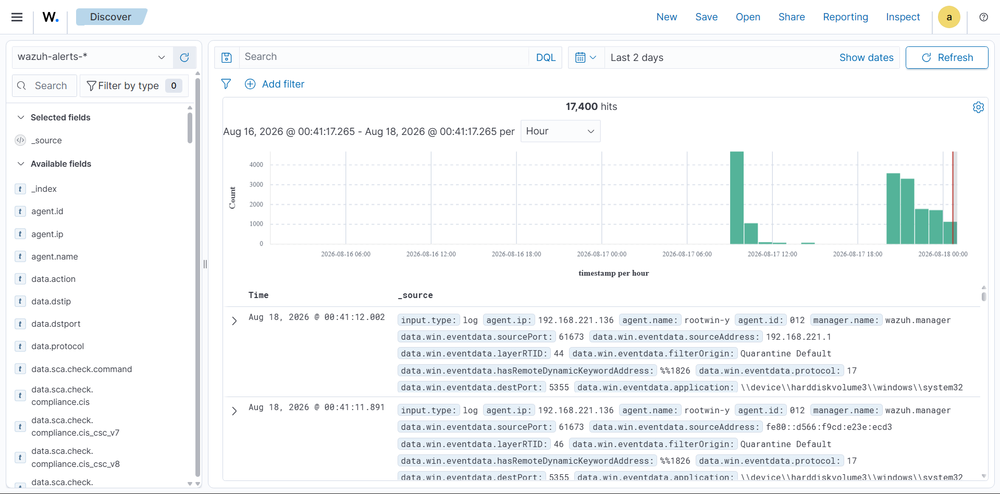
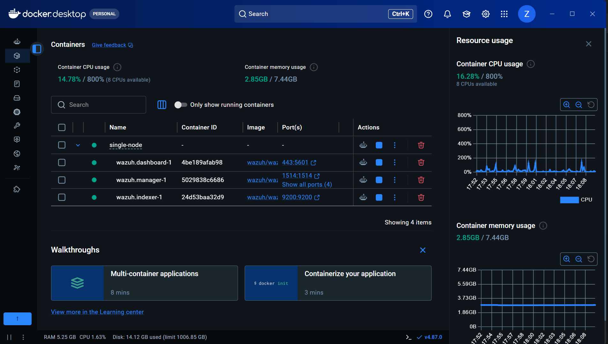
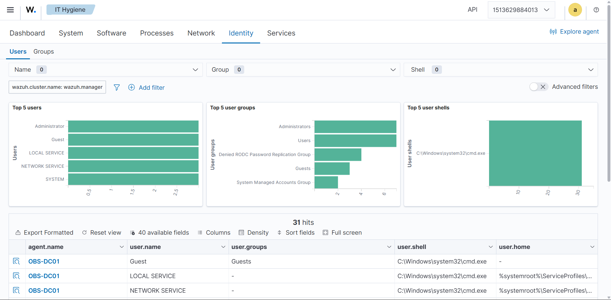

# Enterprise SOC Lab

**A Wazuh SIEM homelab, built from scratch, for detecting real Active Directory attacks.**

      

[Enterprise-SOC-Lab](https://github.com/Zabi-01/Enterprise-SOC-Lab) · [Active-Directory-Attack-Lab](https://github.com/Zabi-01/Active-Directory-Attack-Lab)

---

## Overview

This lab was built from scratch to see what an enterprise SOC actually catches — and misses — when a domain gets attacked end-to-end. A Windows Server 2025 Domain Controller, two domain-joined Windows 11 clients, and a Kali attacker sit on an isolated VMware NAT network, all shipping telemetry to a Wazuh stack running in Docker inside WSL2 on the host.

  
<table align="center">
<tr>
<td align="center"> <b>Overview</b></td>
<td align="center"> <b>Discover</b></td>
</tr>
<tr>
<td align="center"> <b>Docker</b></td>
<td align="center"> <b>IT Hygiene</b></td>
</tr>
</table>

## Stack

| Component | Detail |
|---|---|
| SIEM | Wazuh 4.14.6 — single-node Docker (Manager, Indexer, Dashboard) |
| Manager host | WSL2 (Ubuntu 24.04) + Docker, on the physical host |
| Telemetry | Windows Security log, Sysmon, PowerShell Script Block, FIM, Windows Firewall |
| Agents | 3 — Domain Controller + 2 clients. Kali left unmonitored, matching the attacker/defender split |

## Detection Coverage

| Attack | Event ID(s) | Status | Notes |
|---|---|---|---|
| Port scanning (nmap) | 5157 | ✅ Detected | ~600 events |
| Failed logon / brute force (Hydra) | 4625 | ✅ Detected | 81 events |
| Successful logon | 4624 | ✅ Detected | 1,047 events |
| Kerberoasting | 4769 | ✅ Detected | 48 events |
| Pass-the-Hash | Rule 92652 | ✅ Detected | 128 events, custom Wazuh rule |
| Privileged logon | 4672 | ✅ Detected | 114 events |
| User creation | 4720 | ✅ Detected | |
| Domain group modification | 4728 / 4732 | ✅ Detected | |
| Service creation | 7045 | ✅ Detected | 17 events |
| Persistence (file drop) | Rule 92213 | ✅ Detected | 9 events, level 15 |

## MITRE ATT&CK Coverage

| # | Technique | ID | Tactic(s) | Event/Rule ID(s) | Alerts |
|---|---|---|---|---|---|
| 1 | Valid Accounts | `T1078` | Defense Evasion, Initial Access, Persistence, Privilege Escalation | `4624` `4625` `4672` | 709 |
| 2 | Domain Accounts | `T1078.002` | Defense Evasion, Initial Access, Lateral Movement, Persistence, Privilege Escalation | `4728` `4732` | 258 |
| 3 | Pass the Hash | `T1550.002` | Defense Evasion, Initial Access, Lateral Movement, Persistence, Privilege Escalation | Rule `92652` `92657` | 258 |
| 4 | Domain Policy Modification | `T1484` | Defense Evasion, Privilege Escalation | — | 206 |
| 5 | Ingress Tool Transfer | `T1105` | Command and Control | — | 180 |
| 6 | Account Discovery | `T1087` | Discovery | Rule `92039` | — |
| 7 | Windows Command Shell | `T1059.003` | Execution | Rule `92032` `92052` | — |
| 8 | File Deletion | `T1070.004` | Defense Evasion | Rule `92021` | — |
| 9 | Lateral Tool Transfer | `T1570` | Lateral Movement | — | — |

Full time-boxed breakdown (alerts evolution, top tactics, per-agent technique split) is in the [MITRE ATT&CK report](Reports/wazuh-module-overview-mitre-1787061889.pdf).

### Notable Alerts

A few of the higher-signal hits pulled from the full alerts summary, worth calling out beyond the raw counts:

| Rule ID | Description | Level |
|---|---|---|
| `92203` | `mimikatz.exe` created via PowerShell | 6 |
| `92026` | `reg.exe` used to dump the SAM hive | 14 |
| `60159` | Domain Admins group changed | 12 |
| `92103` | LDAP activity from a PowerShell process — possible remote system discovery | 6 |
| `92219` | DLL search-order hijack — payload dropped in the Windows root folder | 6 |
| `92650` | New Windows service created from the Windows root path (admin-share abuse pattern) | 12 |

## Alert Severity

Last 24 hours:

| Severity | Level | Count |
|---|---|---|
| Critical | 15+ | 18 |
| High | 12–14 | 120 |
| Medium | 7–11 | 5,183 |
| Low | 0–6 | 11,822 |

## Reports

Exported Wazuh reports backing the numbers above:

- [Threat Hunting report](Reports/wazuh-module-overview-general-1787061996.pdf) — alert trends, top rules, agent summary
- [IT Hygiene report](Reports/wazuh-module-overview-it-hygiene-1787062117.pdf) — installed software, running processes, port/service inventory
- [MITRE ATT&CK report](Reports/wazuh-module-overview-mitre-1787061889.pdf) — alerts evolution, top tactics, per-agent technique breakdown, full alerts summary

## Documentation

| Doc | Covers |
|---|---|
| [`01-architecture.md`](01-architecture.md) | Full lab topology |
| [`02-wsl-docker-wazuh-setup.md`](02-wsl-docker-wazuh-setup.md) | Wazuh deployment via WSL2/Docker |
| [`03-network-configuration.md`](03-network-configuration.md) | VMnet8 NAT setup, IP scheme |
| [`04-windows-audit-policy.md`](04-windows-audit-policy.md) | Audit policy configuration |
| [`05-sysmon-agent-deployment.md`](05-sysmon-agent-deployment.md) | Sysmon + agent enrollment |
| [`06-detection-coverage.md`](06-detection-coverage.md) | Full results and mapping |

## Screenshots

[Architecture Diagram](Architecture%20Diagram.png) · [Wazuh Overview](Screenshots/Wazuh_Overview.png) · [Wazuh Discover](Screenshots/Wazuh_Discover.png) · [Wazuh Endpoints](Screenshots/Wazuh_Endpoints.png) · [Wazuh IT Hygiene](Screenshots/Wazuh_IT_Hygine.png) · [Wazuh MITRE ATT&CK](Screenshots/Wazuh_MITRE_ATT%26CK.png) · [WSL](Screenshots/WSL.png) · [Docker](Screenshots/Docker.png)

---

Attack methodology and stage-by-stage writeups: **[Active-Directory-Attack-Lab](https://github.com/Zabi-01/Active-Directory-Attack-Lab)**
