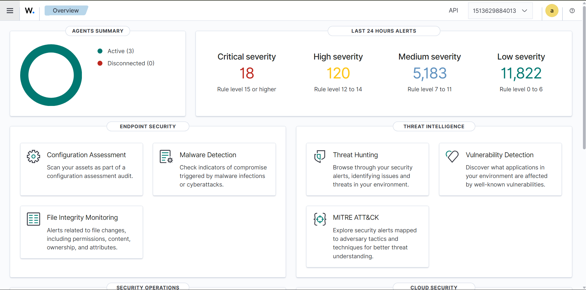

# Enterprise SOC Lab

**A Wazuh SIEM homelab, built from scratch, for detecting real Active Directory attacks.**

[Enterprise-SOC-Lab](https://github.com/Zabi-01/Enterprise-SOC-Lab) · [Active-Directory-Attack-Lab](https://github.com/Zabi-01/Active-Directory-Attack-Lab)

---

## Overview

This lab was built from scratch to see what an enterprise SOC actually catches — and misses — when a domain gets attacked end-to-end. A Windows Server 2025 Domain Controller, two domain-joined Windows 11 clients, and a Kali attacker sit on an isolated VMware NAT network, all shipping telemetry to a Wazuh stack running in Docker inside WSL2 on the host.

## Stack

| Component | Detail |
|---|---|
| SIEM | Wazuh 4.14.6 — single-node Docker (Manager, Indexer, Dashboard) |
| Manager host | WSL2 (Ubuntu 24.04) + Docker, on the physical host |
| Telemetry | Windows Security log, Sysmon, PowerShell Script Block, FIM, Windows Firewall |
| Agents | 3 — Domain Controller + 2 clients. Kali left unmonitored, matching the attacker/defender split |

## Detection Coverage

| Attack | Event ID(s) | Status | Notes |
|---|---|---|---|
| Port scanning (nmap) | 5157 | ✅ Detected | ~600 events |
| Failed logon / brute force (Hydra) | 4625 | ✅ Detected | 81 events |
| Successful logon | 4624 | ✅ Detected | 1,047 events |
| Kerberoasting | 4769 | ✅ Detected | 48 events |
| Pass-the-Hash | Rule 92652 | ✅ Detected | 128 events, custom Wazuh rule |
| Privileged logon | 4672 | ✅ Detected | 114 events |
| User creation | 4720 | ✅ Detected | |
| Domain group modification | 4728 / 4732 | ✅ Detected | |
| Service creation | 7045 | ✅ Detected | 17 events |
| Persistence (file drop) | Rule 92213 | ✅ Detected | 9 events, level 15 |

## MITRE ATT&CK Coverage

1. **Valid Accounts** — Defense Evasion, Initial Access, Persistence, Privilege Escalation — `4624` `4625` `4672` — 709 alerts
2. **Domain Accounts** — Defense Evasion, Initial Access, Lateral Movement, Persistence, Privilege Escalation — `4728` `4732` — 258 alerts
3. **Pass the Hash** — Defense Evasion, Initial Access, Lateral Movement, Persistence, Privilege Escalation — Rule `92652` — 258 alerts
4. **Domain Policy Modification** — Defense Evasion, Privilege Escalation — 206 alerts
5. **Ingress Tool Transfer** — Command and Control — 180 alerts

## Alert Severity

| Severity | Level | Count |
|---|---|---|
| Critical | 15+ | 18 |
| High | 12–14 | 120 |
| Medium | 7–11 | 5,181 |
| Low | 0–6 | 11,641 |

## Documentation

| Doc | Covers |
|---|---|
| [`01-architecture.md`](01-architecture.md) | Full lab topology |
| [`02-wsl-docker-wazuh-setup.md`](02-wsl-docker-wazuh-setup.md) | Wazuh deployment via WSL2/Docker |
| [`03-network-configuration.md`](03-network-configuration.md) | VMnet8 NAT setup, IP scheme |
| [`04-windows-audit-policy.md`](04-windows-audit-policy.md) | Audit policy configuration |
| [`05-sysmon-agent-deployment.md`](05-sysmon-agent-deployment.md) | Sysmon + agent enrollment |
| [`06-detection-coverage.md`](06-detection-coverage.md) | Full results and mapping |

## Screenshots

[Architecture Diagram](Screenshots/Architecture%20Diagram.png) · [Wazuh Overview](Screenshots/Wazuh_Overview.png) · [Wazuh Discover](Screenshots/Wazuh_Discover.png) · [Wazuh Endpoints](Screenshots/Wazuh_Endpoints.png) · [Wazuh IT Hygiene](Screenshots/Wazuh_IT_Hygine.png) · [Wazuh MITRE ATT&CK](Screenshots/Wazuh_MITRE_ATT%26CK.png) · [WSL](Screenshots/WSL.png) · [Docker](Screenshots/Docker.png)

---

Attack methodology and stage-by-stage writeups: **[Active-Directory-Attack-Lab](https://github.com/Zabi-01/Active-Directory-Attack-Lab)**
